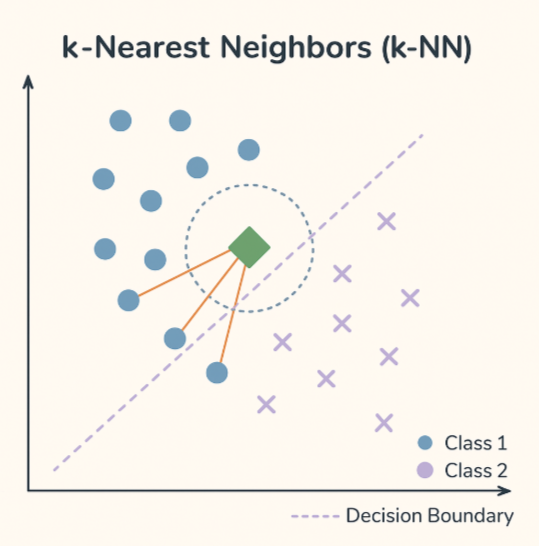

# k-Nearest Neighbors

  

k-Nearest Neighbors is a simple yet effective instance-based learning algorithm. For classification, it assigns a label to a new data point based on the majority class among its k nearest neighbors in the feature space, typically measured using Euclidean distance. For regression, it averages the target values of the nearest neighbors. k-NN is a non-parametric model (makes no assumptions about the data distribution), which makes it flexible, but also computationally expensive as it requires storing and comparing all training data. It performs well in low-dimensional spaces and is often used as a baseline for classification task
